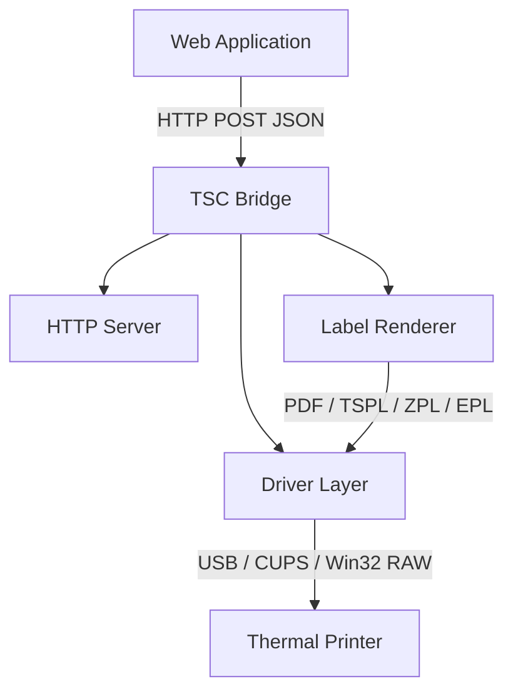

# TSC Bridge

A universal thermal label printing bridge. One binary, any printer, any
platform.

TSC Bridge connects web applications to thermal label printers through a local
HTTP API. It runs as a system tray application, receives print jobs over
`localhost`, and sends them to the printer using the appropriate label language
(TSPL, ZPL, EPL, and more through community drivers).

[Releases](https://github.com/nicoyarce/tsc-bridge/releases) |
[Documentation](#documentation) |
[Contributing](CONTRIBUTING.md)

---

## Table of Contents

- [Features](#features)
- [Install](#install)
- [Quick Start](#quick-start)
- [How It Works](#how-it-works)
- [API Reference](#api-reference)
- [Label Format](#label-format)
- [Drivers](#drivers)
- [Documentation](#documentation)
- [Building from Source](#building-from-source)
- [Contributing](#contributing)
- [License](#license)

## Features

- **Single binary** -- no runtime, no installer, no database
- **Cross-platform** -- macOS (arm64), Windows (amd64, i386), Linux (amd64)
- **Native UI** -- system tray icon with embedded dashboard window
- **HTTP API** -- plain JSON over localhost, CORS-aware
- **Label designer** -- interactive drag-and-drop editor in the dashboard
- **Batch printing** -- import Excel/CSV, map columns to fields, print hundreds
- **PDF output** -- vector PDF generation with TrueType fonts
- **Driver architecture** -- extensible support for multiple printer brands
- **QR and barcodes** -- Code 128, Code 39, EAN-13, UPC-A, QR codes, vCards
- **Auto-DPI detection** -- reads printer capabilities on macOS and Windows
- **USB direct printing** -- bypasses the OS print spooler via libusb
- **TLS on localhost** -- self-signed certificate for HTTPS origins
- **Whitelabel** -- custom branding (name, logo, colors) per deployment

## Install

### macOS

Download the DMG from the
[releases page](https://github.com/nicoyarce/tsc-bridge/releases), open it,
and drag **TSC Bridge.app** to your Applications folder.

Or install the raw binary:

```sh
curl -fsSL https://github.com/nicoyarce/tsc-bridge/releases/latest/download/tsc-bridge-mac -o /usr/local/bin/tsc-bridge
chmod +x /usr/local/bin/tsc-bridge
```

### Windows

Download `tsc-bridge-win-<version>.zip` from the releases page. Extract and run
`install_windows.bat` as administrator, or compile `tsc-bridge.iss` with
[InnoSetup](https://jrsoftware.org/isinfo.php) for a GUI installer.

### Linux

```sh
curl -fsSL https://github.com/nicoyarce/tsc-bridge/releases/latest/download/tsc-bridge-linux-amd64 -o /usr/local/bin/tsc-bridge
chmod +x /usr/local/bin/tsc-bridge
```

On Linux, you may need to add your user to the `lp` group for USB printer
access:

```sh
sudo usermod -aG lp $USER
```

## Quick Start

1. Start the bridge:

```sh
tsc-bridge
```

2. The system tray icon appears. Click it and select **Dashboard** to open the
   native window.

3. Send a print job from your web application:

```sh
curl -X POST http://127.0.0.1:9638/print \
  -H "Content-Type: application/json" \
  -d '{
    "printer": "TSC_TDP-244_Plus",
    "data": "SIZE 50 mm, 30 mm\nGAP 3 mm, 0 mm\nCLS\nTEXT 10,10,\"3\",0,1,1,\"Hello World\"\nPRINT 1,1\n"
  }'
```

## How It Works



The bridge runs on `127.0.0.1:9638` (configurable). Web applications send
label data as JSON. The bridge renders the label using the appropriate driver
and sends the raw commands to the printer.

## API Reference

All endpoints accept and return JSON. The base URL is `http://127.0.0.1:9638`.

### `GET /status`

Returns bridge status, connected printers, and version.

### `GET /printers`

Lists all detected printers with type, status, and capabilities.

### `POST /print`

Sends a raw print job. Body: `{ "printer": "name", "data": "TSPL commands" }`.

### `POST /batch-pdf`

Generates a multi-page PDF from a template and row data. Body:
`{ "template_id": "uuid", "rows": [...], "mapping": {...} }`.

Query parameter `?mode=url` returns a download URL instead of the binary file.

### `POST /batch-tspl`

Generates TSPL commands from a template and prints them. Body:
`{ "template_id": "uuid", "rows": [...], "printer": "name" }`.

Modes: `print` (default), `preview` (returns TSPL text), `raster` (bitmap).

### `GET /dashboard`

Serves the embedded HTML dashboard.

### `GET /output/{filename}`

Serves generated files (PDF, images). Add `?dl=1` to force download.

For the complete API reference, see [docs/API.md](docs/API.md).

## Label Format

TSC Bridge uses a JSON-based label format inspired by
[pdfme](https://pdfme.com/). The format describes page dimensions, field
positions, types, and variable bindings.

```json
{
  "basePdf": { "width": 50, "height": 30 },
  "schemas": [
    [
      {
        "name": "product_name",
        "type": "text",
        "position": { "x": 5, "y": 5 },
        "width": 40,
        "height": 8,
        "fontSize": 12,
        "fontName": "Helvetica"
      },
      {
        "name": "barcode",
        "type": "barcodes128",
        "position": { "x": 5, "y": 15 },
        "width": 40,
        "height": 10
      }
    ]
  ]
}
```

Field types: `text`, `multiVariableText`, `qrcode`, `barcodes128`,
`barcodes39`, `image`, `line`, `rectangle`.

For the complete specification, see
[docs/LABEL_STANDARD.md](docs/LABEL_STANDARD.md).

## Drivers

TSC Bridge uses a driver architecture to support multiple printer brands and
label languages. Each driver translates the universal label format into
printer-specific commands.

### Built-in Drivers

| Driver | Language | Printers |
|--------|----------|----------|
| TSPL   | TSPL2    | TSC TDP-244, TTP-245, TE200, TE300 series |
| PDF    | PDF 1.4  | Any printer via OS print dialog |

### Community Drivers (planned)

| Driver | Language | Printers | Status |
|--------|----------|----------|--------|
| ZPL    | ZPL II   | Zebra ZD, ZT, GK, GX series | Seeking contributors |
| EPL    | EPL2     | Zebra LP, TLP legacy series | Seeking contributors |
| CPCL   | CPCL     | Zebra mobile printers | Seeking contributors |
| ESC/POS| ESC/POS  | Epson, Star, Bixolon receipt printers | Seeking contributors |
| DPL    | DPL      | Datamax-O'Neil / Honeywell | Seeking contributors |
| SBPL   | SBPL     | SATO printers | Seeking contributors |
| Fingerprint | Fingerprint | Intermec / Honeywell | Seeking contributors |

To write a new driver, see [docs/DRIVERS.md](docs/DRIVERS.md).

## Documentation

- [Architecture](ARCHITECTURE.md) -- system design and component overview
- [Goals](GOALS.md) -- project priorities and non-goals
- [Label Standard](docs/LABEL_STANDARD.md) -- label format specification
- [Driver Guide](docs/DRIVERS.md) -- how to write a printer driver
- [API Reference](docs/API.md) -- complete HTTP API documentation
- [Changelog](CHANGELOG.md) -- version history
- [Contributing](CONTRIBUTING.md) -- how to contribute
- [Security](SECURITY.md) -- vulnerability reporting
- [Code of Conduct](CODE_OF_CONDUCT.md) -- community guidelines

## Building from Source

### Prerequisites

- Go 1.21 or later
- CGO enabled (required for system tray and USB)
- macOS: Xcode Command Line Tools, `brew install libusb`
- Windows: MinGW-w64
- Linux: `apt install libusb-1.0-0-dev libgtk-3-dev libappindicator3-dev`

### Build

```sh
git clone https://github.com/nicoyarce/tsc-bridge.git
cd tsc-bridge

# macOS
make build-mac

# Windows (from Windows or with MinGW cross-compiler)
make build-windows

# Linux
go build -o tsc-bridge .
```

### Test

```sh
go test ./...
```

### Full Release Build

The `build.sh` script builds all platforms, generates icons, creates the macOS
`.app` bundle and DMG, and packages the Windows installer:

```sh
./build.sh
```

## Contributing

Contributions are welcome. See [CONTRIBUTING.md](CONTRIBUTING.md) for
guidelines. The most impactful way to contribute is by writing a driver for a
printer brand you have access to.

## License

[MIT](LICENSE)
